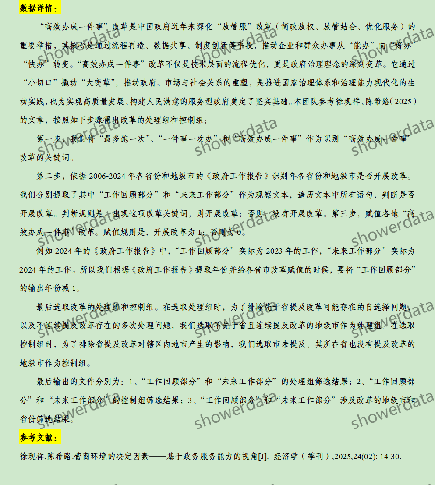
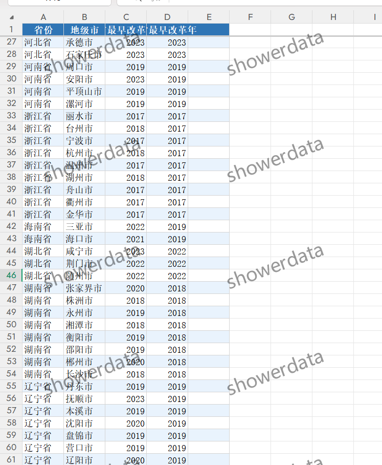
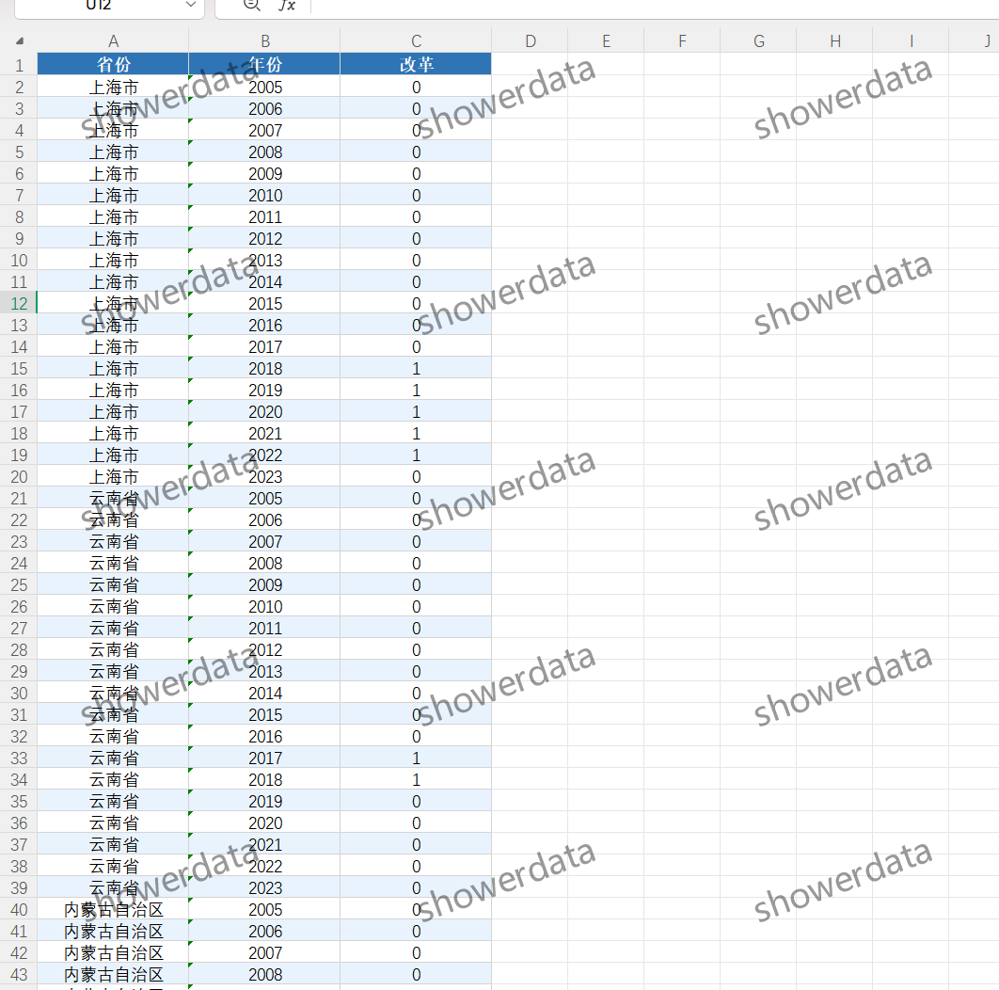
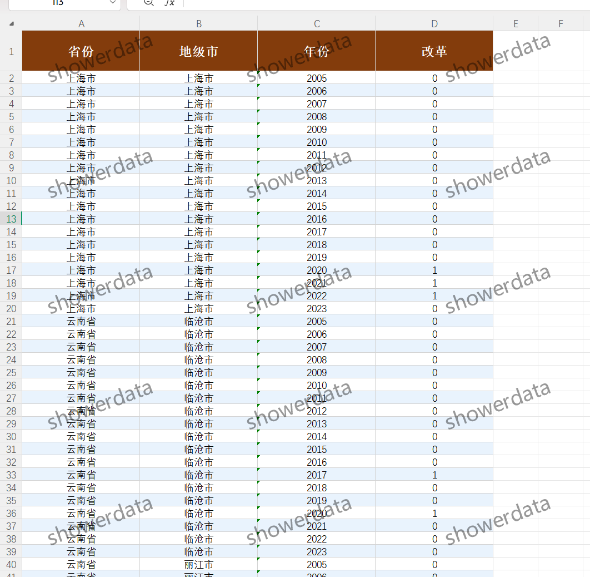
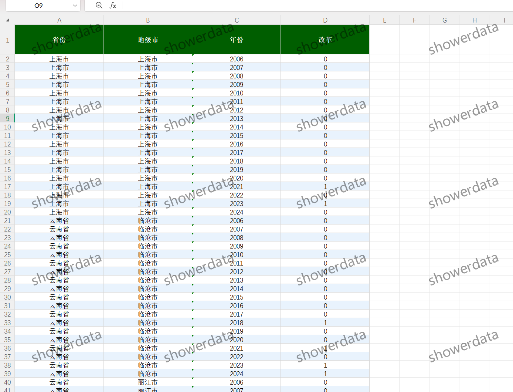
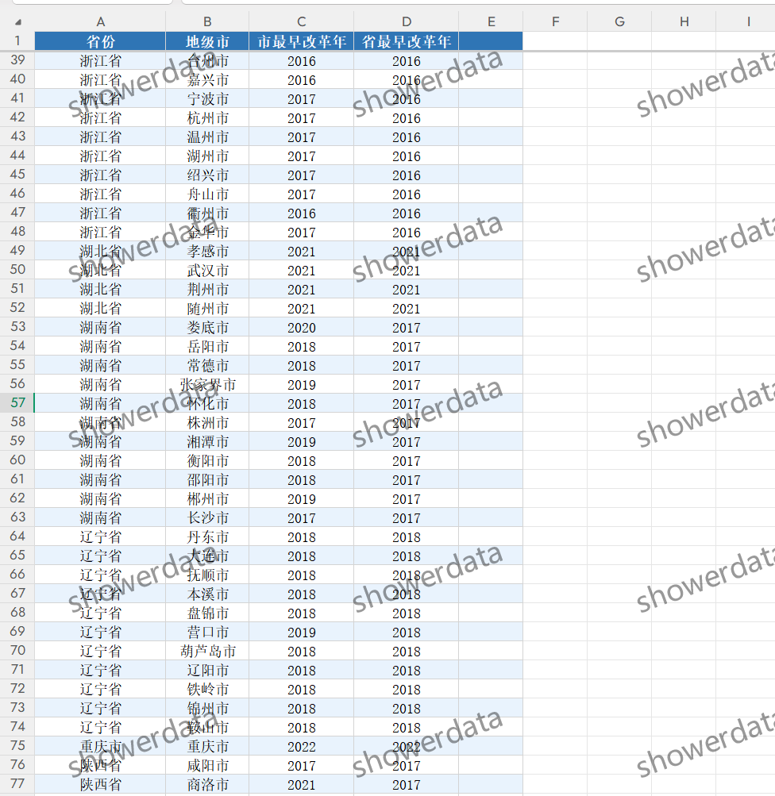

## Body

（2006-2024年）地级市-政府服务改革DID数据

注意事项：见下方图片，拍前请看清楚！已完整展示说明，请确定好是不是自己需要的再拍下！发货后任何理由不退不换！拍前请确认自己会使用再拍，不提供答疑，谢谢！数据可能会有客观原因所致缺失值，介意勿拍，谢谢！
只有excel格式，只有算好的，没有do文件，没有原始数据，没有stata格式，图里是我导入stata做的描述性统计，不要看了问我为什么找不到图里的内容了。

一、数据介绍
（1）数据名称：地级市-政府服务改革DID数据
（2）样本范围：2006-2024年
（3）结果数据格式：excel
（4）数据内容：结果
（5）数据来源：zf工作报告识别

二、数据结果指标如图所示

三、测算方法如图所示

四、参考文献如图所示

## Images

Here is a pay link on Stripe ( https://buy.stripe.com/3cs8yP7sY87d0vu9AB ). Please contact me lonlonago@foxmail.com after funding $89, and I will send you a complete data files , thank you!

